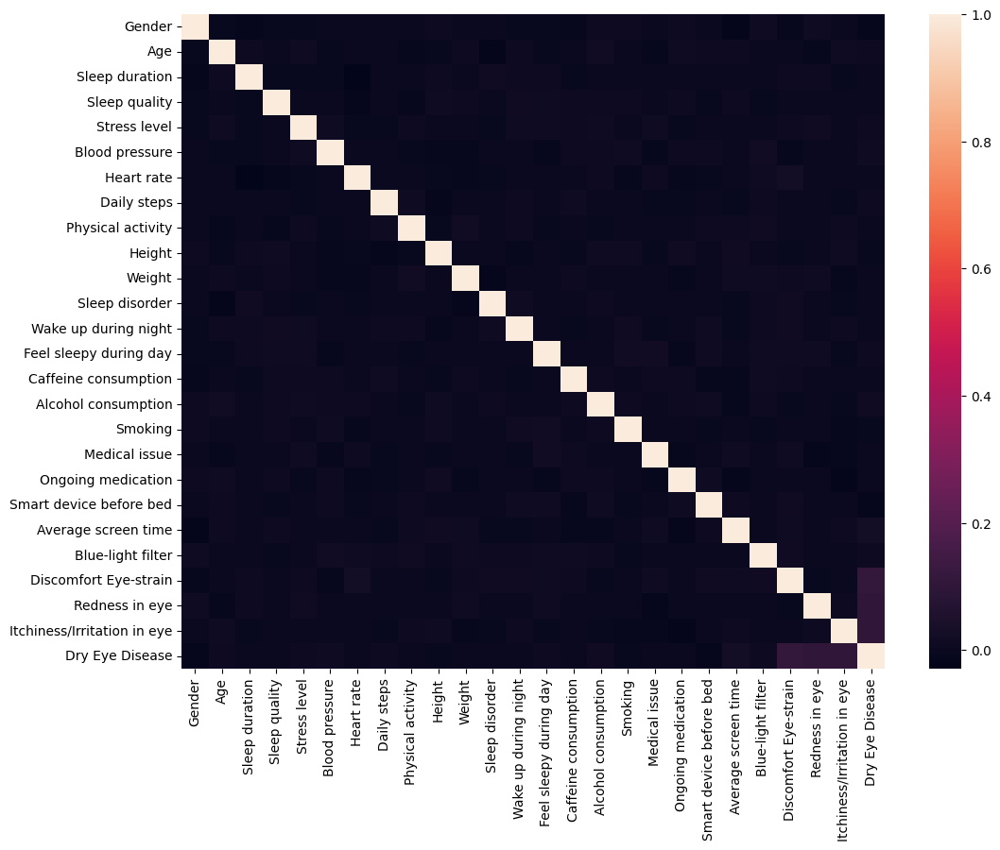
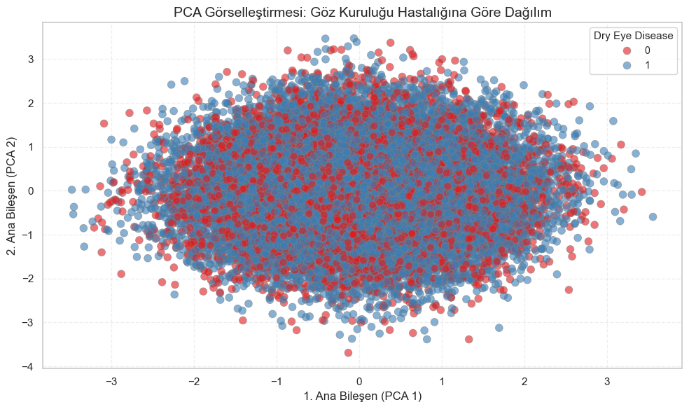
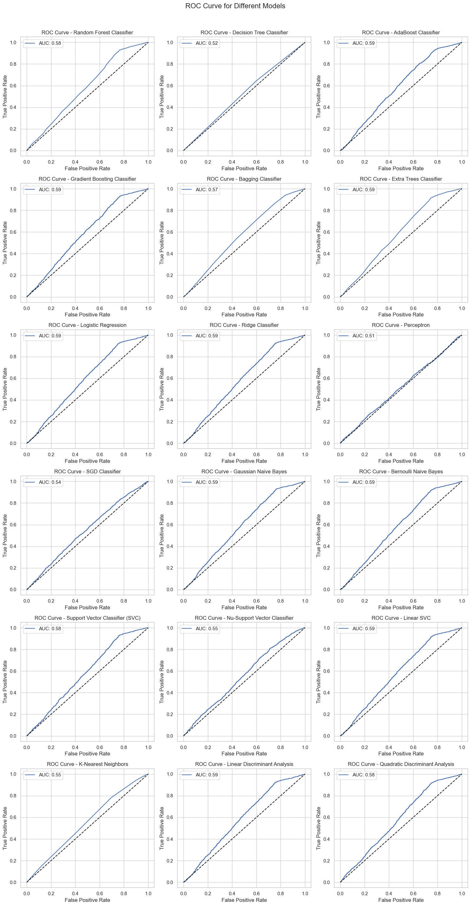
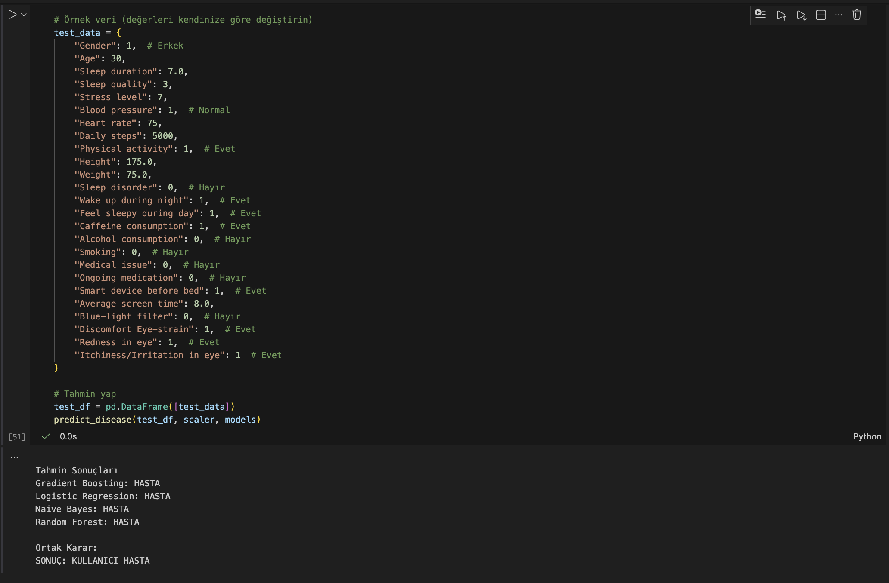

# Dry Eye Disease Prediction 

A comprehensive machine learning project that predicts dry eye disease using 18 different classification algorithms. This project analyzes 25 health and lifestyle features to determine the risk of developing dry eye disease.

## Team Members
- **152120211097** - Çağrı Elagöz
- **152120221072** - Berkay Kayabaşı  
- **152120221085** - Samet Toka

## Project Overview

This project implements a complete ML pipeline for dry eye disease prediction, including:
- Exploratory Data Analysis (EDA)
- Statistical hypothesis testing
- Feature correlation analysis
- Principal Component Analysis (PCA)
- 18 classification models comparison
- Interactive prediction system

## Dataset

The dataset contains **25 features** including:
- **Demographics**: Gender, Age, Height, Weight
- **Sleep Patterns**: Duration, Quality, Disorders, Wake up frequency
- **Lifestyle**: Physical activity, Screen time, Caffeine, Alcohol, Smoking
- **Health Metrics**: Blood pressure, Heart rate, Daily steps, Stress level
- **Eye-related Symptoms**: Strain, Redness, Itchiness, Blue-light filter usage

## Key Visualizations

### Correlation Heatmap

*Feature correlations reveal relationships between lifestyle factors and dry eye disease*

### PCA Analysis

*2D visualization of disease distribution using Principal Component Analysis*

### Model Comparison

*Performance comparison across 18 classification algorithms*

### ROC Curves - All Models

*ROC curves demonstrating the performance of all 18 classification models*

### ROC Curves - Best 4 Models

*Top performing models: Gradient Boosting, Logistic Regression, Gaussian Naive Bayes, and Random Forest*

### Prediction Output Example

*Sample prediction output showing multi-model consensus voting*

## Machine Learning Models

We tested **18 classification algorithms**:

**Ensemble Methods:**
- Random Forest Classifier ⭐
- Gradient Boosting Classifier ⭐
- AdaBoost Classifier
- Bagging Classifier
- Extra Trees Classifier

**Linear Models:**
- Logistic Regression ⭐
- Ridge Classifier
- Perceptron
- SGD Classifier

**Naive Bayes:**
- Gaussian Naive Bayes ⭐
- Bernoulli Naive Bayes

**Support Vector Machines:**
- SVC
- Nu-SVC
- Linear SVC

**Other Classifiers:**
- Decision Tree Classifier
- K-Nearest Neighbors
- Linear Discriminant Analysis
- Quadratic Discriminant Analysis

⭐ = Best performing models

## Model Performance

The **top 4 models** were selected based on accuracy, precision, recall, F1-score, and AUC metrics:

| Model | Key Strength |
|-------|--------------|
| **Gradient Boosting** | Highest accuracy and AUC |
| **Logistic Regression** | Best interpretability |
| **Gaussian Naive Bayes** | Fast training, good recall |
| **Random Forest** | Robust to overfitting |

The final prediction system uses an **ensemble voting approach** combining all 4 models for maximum reliability.

## Statistical Analysis

The notebook includes comprehensive statistical tests:
- **Shapiro-Wilk Test**: Normality testing
- **Kolmogorov-Smirnov Test**: Distribution comparison
- **Anderson-Darling Test**: Goodness-of-fit
- **Mann-Whitney U Test**: Non-parametric group comparison
- **Chi-Square Test**: Categorical variable independence

### Making Predictions

The notebook includes two prediction methods:

**Method 1: Interactive Input** (for environments supporting `input()`)
```python
user_data = get_user_input()
predict_disease(user_data, scaler, models)
```

**Method 2: Manual Data Entry** (recommended for VS Code/Jupyter)
```python
test_data = {
    "Gender": 1,  # 0=Female, 1=Male
    "Age": 30,
    "Sleep duration": 7.0,
    "Sleep quality": 3,
    "Stress level": 7,
    "Blood pressure": 1,  # 0=Low, 1=Normal, 2=High
    # ... (25 features total)
}
test_df = pd.DataFrame([test_data])
predict_disease(test_df, scaler, models)
```

The system outputs predictions from all 4 models and provides a consensus decision.

## Dependencies

- **pandas** - Data manipulation
- **numpy** - Numerical computing
- **matplotlib** - Visualization
- **seaborn** - Statistical visualization
- **scipy** - Scientific computing
- **scikit-learn** - Machine learning
- **jupyter** - Notebook environment

See [requirements.txt](requirements.txt) for specific versions.


## Key Insights

- **Screen time** and **blue-light filter usage** show significant correlation with dry eye disease
- **Gender differences** exist in disease prevalence
- **Sleep quality** and **eye strain** are strong predictors
- Ensemble methods outperform individual classifiers
- PCA reveals clear class separation with just 2 components

